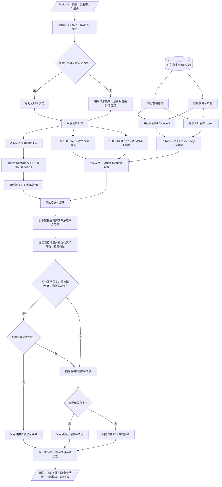

# 波长—载流子浓度耦合的外延层厚度模型流程图

## 核心数学关系

复折射率由本征色散和载流子响应共同决定：

$$
\tilde n_j(\tilde\nu,N_j)=\sqrt{\varepsilon_j(\tilde\nu,N_j)},
\qquad
\varepsilon_j=\varepsilon_{\mathrm{intrinsic}}+\varepsilon_{\mathrm{carrier}},
\qquad
j\in\{\mathrm{epi},\mathrm{sub}\}.
$$

外延层传播相位与非偏振反射率为：

$$
\beta=2\pi d\tilde\nu
\sqrt{\tilde n_{\mathrm{epi}}^2-\sin^2\theta_0},
\qquad
R=\frac{|r_s|^2+|r_p|^2}{2}.
$$

联合反演只开放共享厚度与两个载流子浓度参数：

$$
\Theta=
\left(d,\log_{10}N_{\mathrm{epi}},\log_{10}N_{\mathrm{sub}}\right).
$$

## 当前附件的门控结果

- SiC：附件 2 有约 3.51% 反射率超过 100%，因此进入 `relative_shape` 模式。
- 增强模型可给出仪器响应条件下的双浓度轮廓区间，但不输出绝对浓度点估计。
- 原厚度色散模型的连续波段稳定性仍未通过，厚度主结果继续回退常折射率稳健基线。
- Si：高掺杂固定情景留段稳定，但衬底浓度触及先验边界，因此不报告唯一浓度。
- 两种材料均分别报告条件统计区间和掺杂情景系统范围。
